# 🍕 Sistema de Gestão para Pizzarias

Sistema web desenvolvido para **gestão completa de pizzarias**, permitindo o controle de pedidos, produtos, clientes e administração do negócio de forma simples e eficiente.

⚠️ Este repositório apresenta **apenas demonstrações visuais do sistema**.  
O código-fonte **não está disponível publicamente**, pois o sistema é oferecido através de **licenciamento / locação comercial**.

---

# 📌 Sobre o Sistema

O sistema foi desenvolvido com o objetivo de ajudar pizzarias e estabelecimentos de delivery a **organizar suas operações de forma profissional**.

Com ele é possível controlar:

- pedidos
- produtos
- clientes
- vendas
- administração do sistema

Tudo através de uma **interface simples, rápida e intuitiva**.

---

# 🚀 Funcionalidades

✔ Cadastro de clientes  
✔ Cadastro de produtos  
✔ Gerenciamento de pedidos  
✔ Painel administrativo  
✔ Controle de vendas  
✔ Interface moderna  
✔ Sistema acessível via navegador  

---

# 🖥️ Demonstração do Sistema

## Página inicial da pizzaria
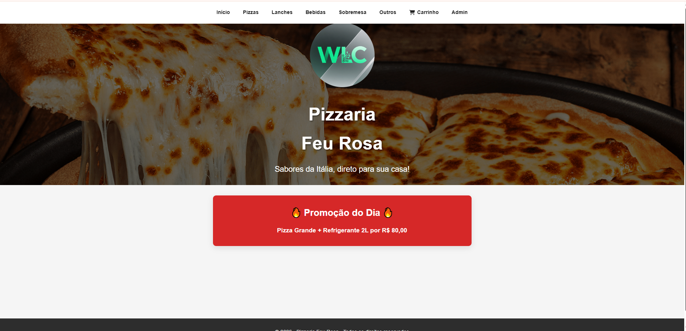

---

## Área administrativa
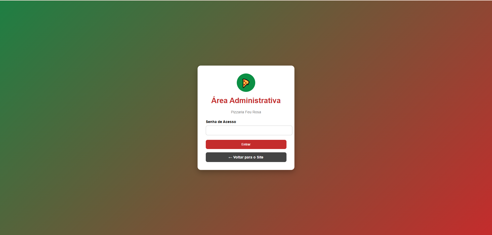

---

## Painel administrativo
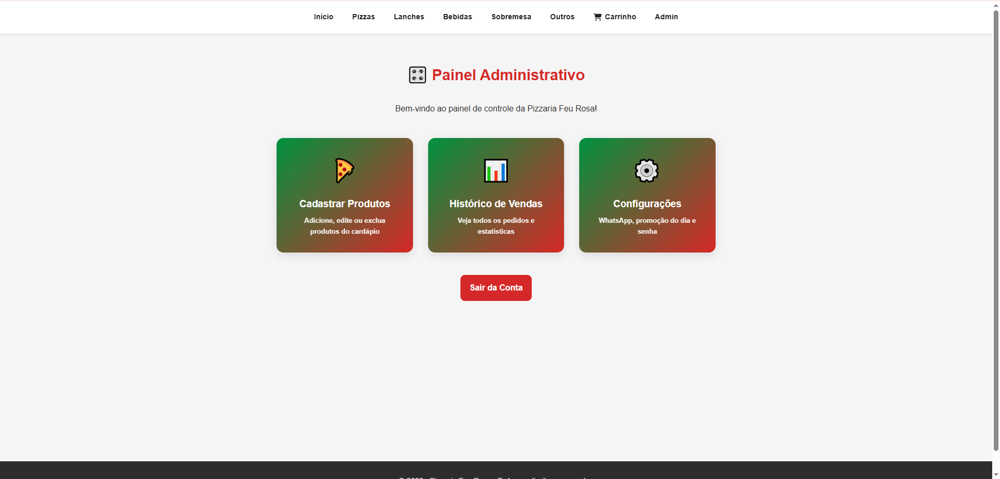

---

## Cadastro de produtos
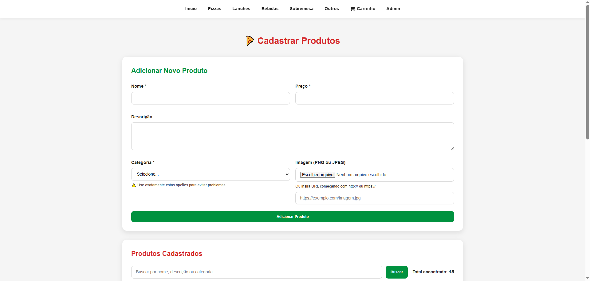

---

## Produto cadastrado
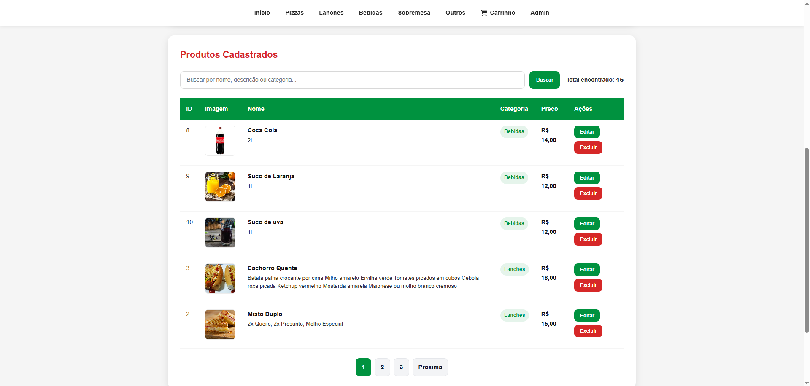

---

## Bebidas
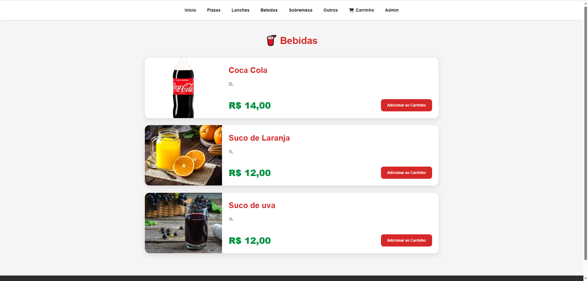

---

## Lanches
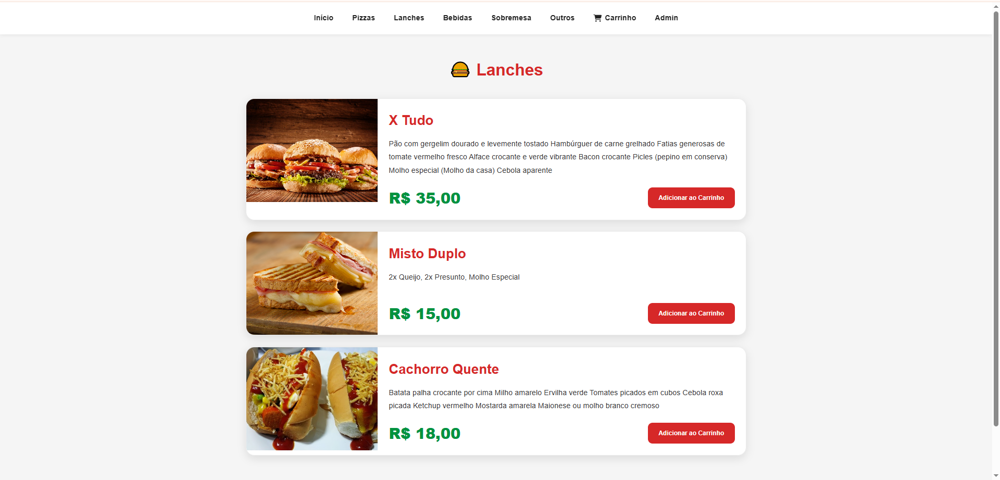

---

## Sobremesas
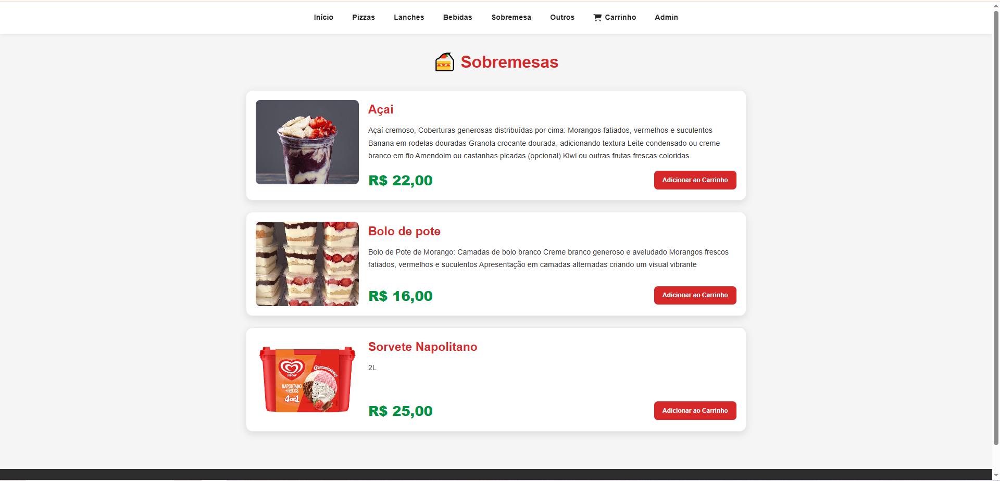

---

## Carrinho de compras
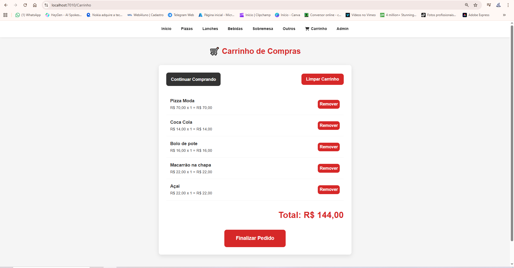

---

## Finalização do pedido
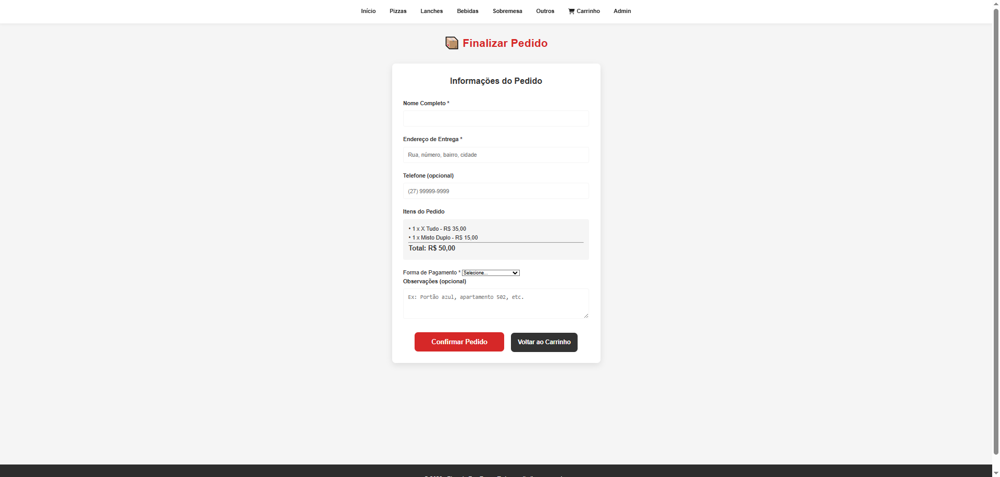

---

## Histórico de vendas
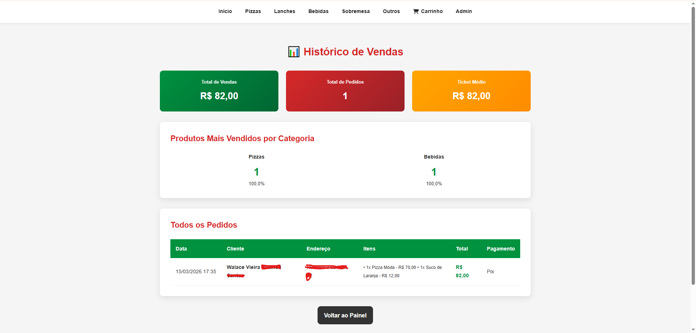

---

## Configurações
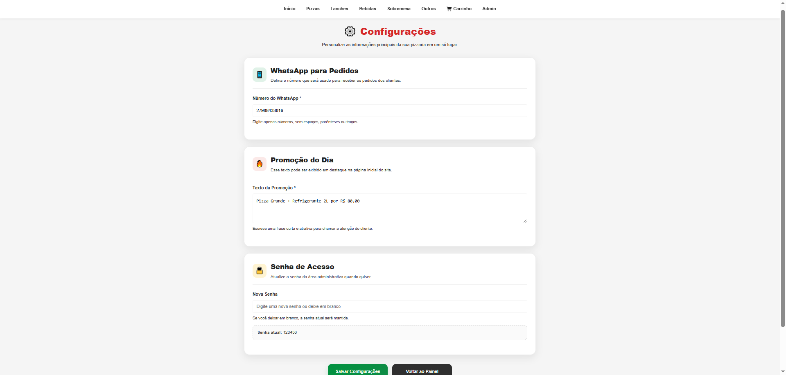

---

# ⚙️ Tecnologias Utilizadas

Este sistema foi desenvolvido utilizando tecnologias modernas para aplicações web:

- ASP.NET
- C#
- HTML5
- CSS3
- JavaScript
- SQLite

---

# 💼 Uso Comercial

Este sistema é **propriedade privada**.

Ele pode ser **licenciado ou alugado para empresas**, sendo ideal para:

- pizzarias
- restaurantes
- lanchonetes
- delivery

---

# 🔒 Código-fonte

O código-fonte **não está disponível neste repositório**.

Este repositório contém apenas **imagens demonstrativas do sistema**.

---

# 📞 Contato

Interessado em utilizar o sistema?

Entre em contato:

**Desenvolvedor:** Walace Vieira  

---

# 📄 Licença

Este projeto é **propriedade privada**.

A reprodução, distribuição ou modificação sem autorização é proibida.

© 2026 - Walace Vieira
